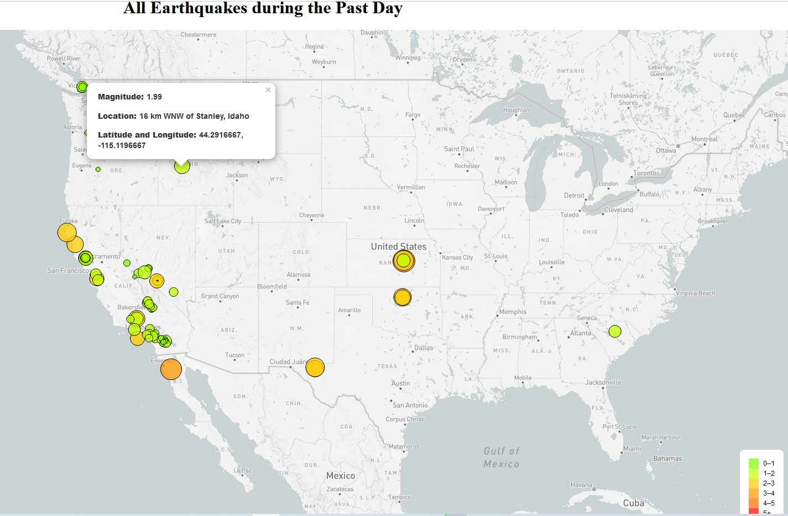

# Usgs Earthquake Mapping

This project contains two webpages which show earthquake activity during the past day using geological data provided by the United States Geological Survey (USGS) via api calls and mapping data from [Mapbox](https://www.mapbox.com/).

The first webpage is a basic map of earthquake activity from the past day.

The second webpage is an interactive map of earthquake activity from the past day. It allows users to view earthquake activity using three different kinds of maps: Satellite, Greyscale, and Outdoors, as well as a map of world tectonic plates.

## Tools/Packages used
- HMTL5
- CSS
- MapBox API
- Javascript
  - Leaflet.js

## How to use
1) Clone the directory
2) Login or sign up to [Mapbox](https://www.mapbox.com/) and get your api token by following these [instructions](https://docs.mapbox.com/accounts/guides/tokens/)
  - To view [earthquake-map-version-1](earthquake-map-version-1) 
    1) go to the [config file](/earthquake-map-version-1/static/js/config.js) and paste your MapBox api token to the variable `const API_KEY`
    2) click on the index.html file in the directory to launch your chosen dashboard.
  - To view [earthquake-map-version-2](earthquake-map-version-2) 
    1) go to the [config file](/earthquake-map-version-2/static/js/config.js) and paste your MapBox api token to the variable `const API_KEY`
    2) open Git Bash in the directory and type `python -m http.server` to launch the python server, then go to your local host, e.g `localhost:8000`.
